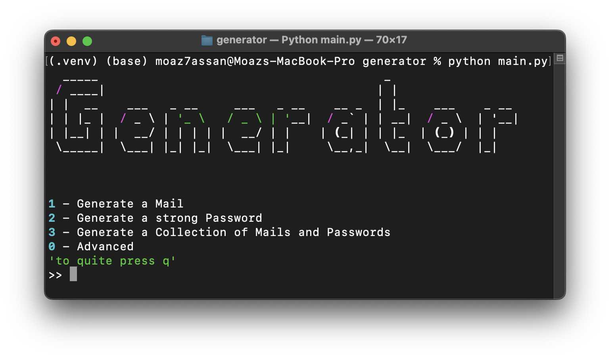

# Mails and Passwords Generator

python tool designed to generate emails, strong passwords, and collections of both.
It offers both standard and advanced options.
You can change the names list in the data directory to suit your needs.

## Features
### Email Generation
- Generate email addresses using popular or random domain providers.
- Supports custom domain inputs for personalized email generation.

### Password Generation
- Create strong, random passwords with a single command.
- Customize password components (lowercase letters, numbers, uppercase letters, special characters) for tailored security needs.

### Collection Generation
- Generate and save collections of email addresses and passwords.
- View collections in the terminal or save them as an Excel file.

### Advanced Options
- Access advanced settings for more control over email and password generation.
- Combine email and password generation into a comprehensive collection.

## Libraries
### rich 
For creating stylish and formatted terminal outputs.
```bash
pip install rich
```

### pyfiglet
For generating ASCII art banners.
```bash
pip install pyfiglet
```

### pandas
For handling collections and exporting them to Excel files.
```bash
pip install pandas
```

### random 
 Built in Python Standard libraries

## Usage
### Main Menu
- Generate a Mail
- Generate a Strong Password
- Generate a Collection of Mails and Passwords
- Access Advanced Options

### Advanced Menu
- Generate custom emails with specific domains.
- Create custom passwords with defined criteria.
- Generate and save custom collections of emails and passwords.
